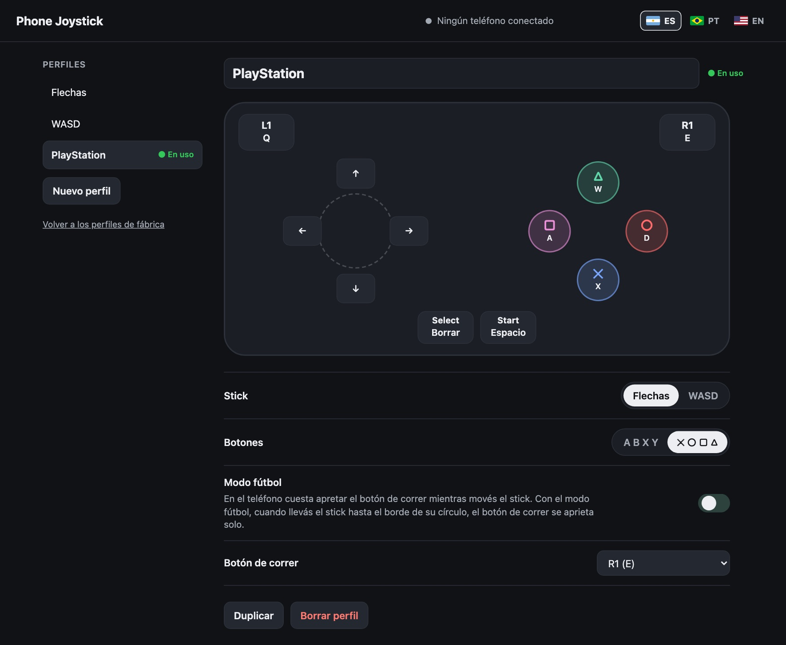

# Phone Joystick

[](https://github.com/aerodiduch/phone-joystick/actions/workflows/ci.yml) [](https://github.com/aerodiduch/phone-joystick/releases/latest) [](https://github.com/aerodiduch/phone-joystick/releases) [](LICENSE)   

[English](README.md) · [Português](README.pt.md)


Phone Joystick convierte tu teléfono en un joystick para tu notebook. Está pensado para cuando no tenés tu setup a mano: en la oficina, en un hotel, de vacaciones. Escaneás un código QR con el teléfono y jugás. El teléfono muestra un stick y botones en el navegador, y la computadora convierte cada toque en una tecla, así que anda con cualquier juego que se juegue con teclado. Lo hice para jugar al [PES 6 Web](https://pes6.optijuegos.net/) en el navegador de la notebook, en el trabajo, y el perfil PlayStation usa las teclas que configuré en ese juego.

- iPhone (Safari) y Android (Chrome). En el teléfono no se instala nada; se escanea un código QR.
- Windows y macOS.
- Stick de 8 direcciones, cuatro botones, L1, R1, Start y Select. La tecla de cada uno se elige en la [página de configuración](#página-de-configuración), y podés tener todos los perfiles que quieras.
- Modo fútbol: si llevás el stick hasta el borde de su círculo, también se aprieta el botón de correr, así corrés mientras el pulgar derecho pasa y patea.
- En español, portugués e inglés.
- Varios dedos a la vez, y un dedo puede deslizarse de un botón al otro.
- Si el teléfono se bloquea o se corta la Wi-Fi, todas las teclas se sueltan en menos de 1,5 segundos.

## Windows

1. Descargá [`phone-joystick.exe`](https://github.com/aerodiduch/phone-joystick/releases/latest/download/phone-joystick.exe) de la última versión.
2. Abrilo con doble clic. El archivo no está firmado, así que Windows puede mostrar *Windows protegió su PC*. Hacé clic en **Más información** y después en **Ejecutar de todas formas**.
3. Cuando el firewall pregunte, permití el acceso en **redes privadas**. Si no, el teléfono no llega a la computadora.
4. Se abre una ventana con un código QR. Escanealo con la cámara del teléfono. El teléfono y la computadora tienen que estar en la misma Wi-Fi.
5. Abrí el juego y hacé clic en su ventana para que quede al frente. Las teclas van a la ventana que esté al frente.
6. Para elegir tus teclas, abrí la [página de configuración](#página-de-configuración).

## macOS

Necesitás [uv](https://docs.astral.sh/uv/getting-started/installation/) (`brew install uv`).

```sh
git clone https://github.com/aerodiduch/phone-joystick
cd phone-joystick
uv run server.py
```

La primera vez, macOS pide el permiso de **Accesibilidad** para la app de terminal (Terminal, iTerm…). Es lo que deja que un programa apriete teclas. Activalo y el servidor sigue solo.

Escaneá el QR de la terminal con el teléfono, abrí el juego y hacé clic en su ventana. Para elegir tus teclas, abrí la [página de configuración](#página-de-configuración).

## Perfiles

Estos tres vienen de fábrica, y en la página de configuración podés cambiarlos o sumar los tuyos. El perfil se cambia desde la barra de arriba del teléfono y la computadora recuerda el último.

| Control | Flechas | WASD | PlayStation |
| --- | --- | --- | --- |
| Stick | ↑ ↓ ← → | W A S D | ↑ ↓ ← → |
| A / ✕ | Espacio | Espacio | X |
| B / ○ | Z | Shift | D |
| X / □ | X | E | A |
| Y / △ | C | Q | W |
| L1 | | | Q |
| R1 | | | E |
| Start | Enter | Enter | Espacio |
| Select | Esc | Esc | Borrar |
| Modo fútbol | apagado | apagado | prendido (R1) |

## Página de configuración



Abrí **http://localhost:8777/setup** en un navegador de la computadora donde corre Phone Joystick. La ventana del código QR también muestra este enlace. La página se abre solo en esa computadora; desde un teléfono u otro equipo de la red da error.

- **Teclas.** Ves el control con la tecla debajo de cada botón. Hacé clic en un botón y apretá la tecla que quieras. **Sin tecla** saca ese botón del teléfono.
- **Perfiles.** Podés crearlos, duplicarlos, renombrarlos y borrarlos, y elegir cuál usa el teléfono con **Usar en el teléfono**.
- **Stick.** Poné las cuatro direcciones en flechas o en WASD con un clic, o hacé clic en cada dirección y asignala como cualquier otro botón.
- **Botones.** Se muestran como A B X Y o como ✕ ○ □ △.
- **Modo fútbol.** En el teléfono cuesta apretar el botón de correr mientras movés el stick. Con el modo fútbol prendido, cuando llevás el stick hasta el borde de su círculo, el botón de correr se aprieta solo, y en el teléfono ese botón se ilumina mientras está apretado. Vos elegís cuál es el botón de correr.
- **Idioma.** Las banderitas de arriba cambian entre español, portugués e inglés, en esta página y en el teléfono.

Los cambios se guardan solos y llegan al teléfono en el momento, aunque estés en medio de un partido y sin reiniciar nada. Si estás apretando un botón justo cuando le cambiás la tecla, se suelta la vieja y se aprieta la nueva.

Se pueden asignar letras, números, flechas, Espacio, Enter, Esc, Tab, Borrar y Shift. Ctrl, Alt y Cmd no, así nadie puede mandarle atajos a tu computadora desde un teléfono.

Tus perfiles se guardan en `profiles.json`, al lado de `server.py`, o en `%APPDATA%\phone-joystick\` con el `.exe`. **Volver a los perfiles de fábrica**, abajo de la lista, recupera los tres originales.

## Si algo no anda

- **El teléfono no se conecta.** Fijate que los dos estén en la misma Wi-Fi. Las redes de oficinas, hoteles y de invitados muchas veces no dejan que los equipos se vean entre sí. Prendé el hotspot del teléfono, conectá la computadora a esa red y reiniciá Phone Joystick, que muestra un QR nuevo. Una VPN también puede bloquear la red local; buscá una opción de "red local" o "LAN" en sus ajustes.
- **El teléfono se conecta pero el juego no responde.** Hacé clic en la ventana del juego. En Windows, un juego que corre como administrador ignora las teclas de los programas comunes; corré `phone-joystick.exe` como administrador también.
- **El antivirus marca el `.exe`.** Los programas empaquetados con PyInstaller a veces dan falsos positivos. Podés correrlo desde el código: instalá uv y seguí los pasos de macOS.

## Seguridad

- Solo se conectan los teléfonos que tienen la clave del QR. Está guardada en `state.json`; si borrás ese archivo, se genera otra clave y otro QR.
- El teléfono manda nombres de botones, nunca teclas. La computadora decide qué tecla aprieta cada botón.
- La página viaja por HTTP sin cifrar en tu red local, así que alguien en la misma red podría leer la clave. En tu casa no hay problema; en una red compartida, cerrá Phone Joystick cuando dejes de jugar.

## Cómo funciona

`server.py` (Python, aiohttp) sirve la página y un WebSocket. El teléfono manda los controles que tiene apretados cada vez que cambian, más un ping cada medio segundo. El servidor aprieta o suelta solo la diferencia, con Quartz `CGEventPost` en macOS y `SendInput` con scan codes en Windows. Cada tecla queda apretada al menos 60 ms, para que un juego que lee el teclado una vez por cuadro no se pierda un toque rápido. El stick es [nipplejs](https://github.com/yoannmoinet/nipplejs).

## Desarrollo

```sh
uv sync
uv run playwright install chromium
uv run pytest
```

Los tests levantan el servidor y la página real en un teléfono emulado con multitoque, sin apretar ninguna tecla. `tests/check_real_keys.py` sí aprieta teclas de verdad en una ventana de navegador que abre; correlo solo en una computadora que nadie esté usando.

## Licencia

MIT. nipplejs también es MIT (`static/vendor/nipplejs-LICENSE`).
