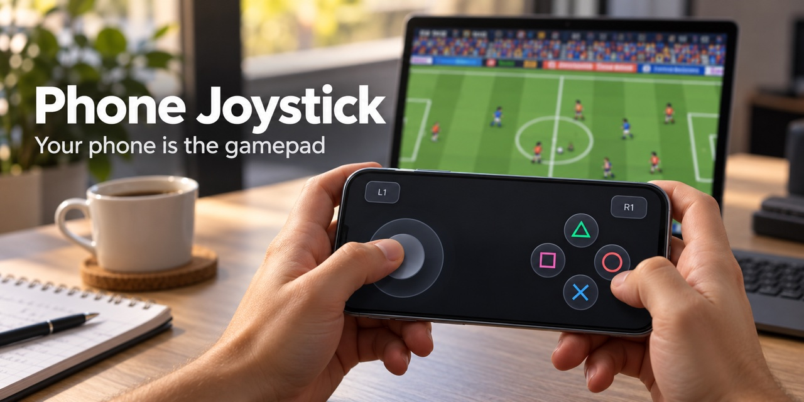
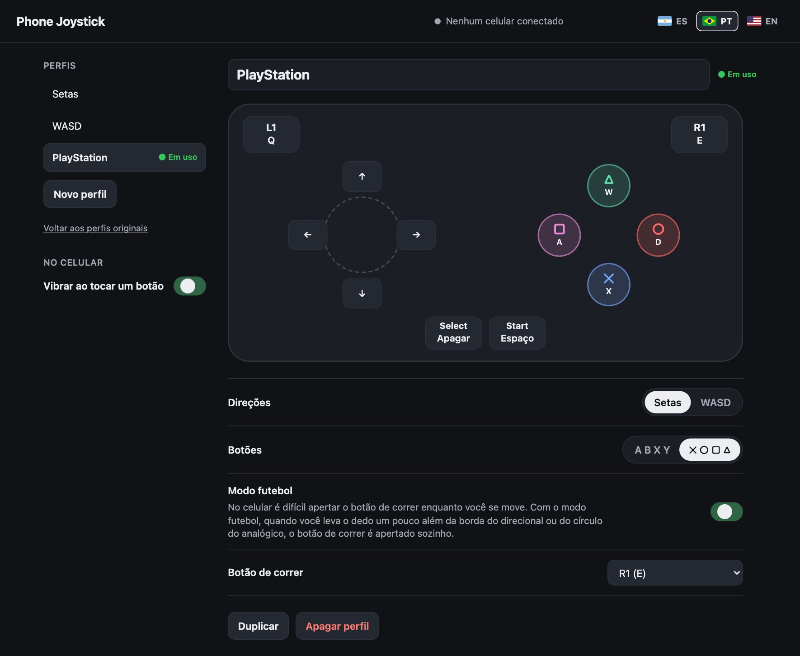

# Phone Joystick

[](https://github.com/aerodiduch/phone-joystick/actions/workflows/ci.yml) [](https://github.com/aerodiduch/phone-joystick/releases/latest) [](https://github.com/aerodiduch/phone-joystick/releases) [](LICENSE)   

[English](README.md) · [Español](README.es.md)



O Phone Joystick transforma o seu celular em um controle para o seu notebook. Ele foi pensado para quando você está longe do seu setup: no escritório, num hotel, nas férias. Você escaneia um QR code com o celular e joga. O celular mostra um analógico e botões no navegador, e o computador transforma cada toque em uma tecla, então funciona com qualquer jogo que se joga pelo teclado. Eu fiz para jogar o [PES 6 Web](https://pes6.optijuegos.net/) no navegador do notebook, no trabalho, e o perfil PlayStation usa as teclas que eu configurei nesse jogo.

- iPhone (Safari) e Android (Chrome). Não precisa instalar nada no celular; é só escanear um QR code.
- Windows e macOS.
- Analógico com 8 direções, quatro botões, L1, R1, Start e Select. A tecla de cada um é escolhida na [página de configuração](#página-de-configuração), e você pode ter quantos perfis quiser.
- Modo futebol: quando você leva o analógico um pouco além da borda do círculo, o botão de correr também é apertado, assim você corre enquanto o polegar direito passa e chuta.
- Em espanhol, português e inglês.
- Vários dedos ao mesmo tempo, e um dedo pode deslizar de um botão para o outro.
- Se o celular bloquear ou o Wi-Fi cair, todas as teclas são soltas em menos de 1,5 segundo.

## Windows

1. Baixe o [`phone-joystick.exe`](https://github.com/aerodiduch/phone-joystick/releases/latest/download/phone-joystick.exe) da versão mais recente.
2. Abra com dois cliques. O arquivo não é assinado, então o Windows pode mostrar *O Windows protegeu o computador*. Clique em **Mais informações** e depois em **Executar assim mesmo**.
3. Quando o firewall perguntar, permita o acesso em **redes privadas**. Sem isso, o celular não chega ao computador.
4. Abre uma janela com um QR code. Escaneie com a câmera do celular. O celular e o computador precisam estar no mesmo Wi-Fi.
5. Abra o jogo e clique na janela dele para deixá-la na frente. As teclas vão para a janela que estiver na frente.
6. Para escolher as suas teclas, abra a [página de configuração](#página-de-configuração).

## macOS

Você precisa do [uv](https://docs.astral.sh/uv/getting-started/installation/) (`brew install uv`).

```sh
git clone https://github.com/aerodiduch/phone-joystick
cd phone-joystick
uv run server.py
```

Na primeira vez, o macOS pede a permissão de **Acessibilidade** para o app de terminal (Terminal, iTerm…). É ela que deixa um programa apertar teclas. Ative e o servidor continua sozinho.

Escaneie o QR code do terminal com o celular, abra o jogo e clique na janela dele. Para escolher as suas teclas, abra a [página de configuração](#página-de-configuração).

## Perfis

Estes três já vêm prontos, e na página de configuração você pode mudá-los ou criar os seus. O perfil é trocado pela barra de cima do celular, e o computador lembra do último.

| Controle | Setas | WASD | PlayStation |
| --- | --- | --- | --- |
| Analógico | ↑ ↓ ← → | W A S D | ↑ ↓ ← → |
| A / ✕ | Espaço | Espaço | X |
| B / ○ | Z | Shift | D |
| X / □ | X | E | A |
| Y / △ | C | Q | W |
| L1 | | | Q |
| R1 | | | E |
| Start | Enter | Enter | Espaço |
| Select | Esc | Esc | Backspace |
| Modo futebol | desligado | desligado | ligado (R1) |

## Página de configuração



Abra **http://localhost:8777/setup** em um navegador do computador onde o Phone Joystick está rodando. A janela do QR code também mostra esse link. A página só abre nesse computador; de um celular ou de outro aparelho da rede, dá erro.

- **Teclas.** Você vê o controle com a tecla embaixo de cada botão. Clique em um botão e aperte a tecla que quiser. **Sem tecla** tira esse botão do celular.
- **Perfis.** Você pode criar, duplicar, renomear e apagar perfis, e escolher qual o celular usa com **Usar no celular**.
- **Analógico.** Coloque as quatro direções nas setas ou em WASD com um clique, ou clique em cada direção e escolha a tecla como em qualquer outro botão.
- **Botões.** Aparecem como A B X Y ou como ✕ ○ □ △.
- **Modo futebol.** No celular é difícil apertar o botão de correr enquanto você move o analógico. Com o modo futebol ligado, quando você leva o analógico um pouco além da borda do círculo, o botão de correr é apertado sozinho, e o botão acende no celular enquanto está apertado. Você escolhe qual é o botão de correr.
- **Idioma.** As bandeirinhas de cima trocam entre espanhol, português e inglês, nesta página e no celular.
- **Vibração.** O celular vibra de leve quando você toca um botão (no iPhone, precisa do iOS 18 ou mais novo). Dá para desligar em **No celular**.

As mudanças são salvas sozinhas e chegam ao celular na hora, mesmo no meio de uma partida e sem reiniciar nada. Se você estiver segurando um botão quando mudar a tecla dele, a tecla antiga é solta e a nova é apertada.

Dá para usar letras, números, setas, Espaço, Enter, Esc, Tab, Backspace e Shift. Ctrl, Alt e Cmd não, assim ninguém consegue mandar atalhos para o seu computador a partir de um celular.

Os seus perfis ficam em `profiles.json`, ao lado do `server.py`, ou em `%APPDATA%\phone-joystick\` com o `.exe`. **Voltar aos perfis originais**, embaixo da lista, recupera os três originais.

## Se algo não funcionar

- **O celular não conecta.** Confira se os dois estão no mesmo Wi-Fi. Redes de escritório, hotel e de visitantes muitas vezes não deixam os aparelhos se enxergarem. Ligue o roteador do celular (Acesso Pessoal, no iPhone), conecte o computador nele e reinicie o Phone Joystick, que mostra um QR code novo. Uma VPN também pode bloquear a rede local; procure uma opção de "rede local" ou "LAN" nos ajustes dela.
- **O celular conecta, mas o jogo não responde.** Clique na janela do jogo. No Windows, um jogo rodando como administrador ignora as teclas de programas comuns; rode o `phone-joystick.exe` como administrador também.
- **O antivírus acusa o `.exe`.** Programas empacotados com PyInstaller às vezes dão falso positivo. Você pode rodar a partir do código: instale o uv e siga os passos do macOS.

## Segurança

- Só conectam os celulares que têm a chave do QR code. Ela fica em `state.json`; se você apagar esse arquivo, uma nova chave e um novo QR code são gerados.
- O celular manda nomes de botões, nunca teclas. O computador decide qual tecla cada botão aperta.
- A página trafega por HTTP sem criptografia na sua rede local, então alguém na mesma rede poderia ler a chave. Em casa não tem problema; numa rede compartilhada, feche o Phone Joystick quando parar de jogar.

## Como funciona

O `server.py` (Python, aiohttp) serve a página e um WebSocket. O celular manda os controles que está apertando sempre que eles mudam, mais um ping a cada meio segundo. O servidor aperta ou solta só a diferença, com Quartz `CGEventPost` no macOS e `SendInput` com scan codes no Windows. Cada tecla fica apertada pelo menos 60 ms, para que um jogo que lê o teclado uma vez por quadro não perca um toque rápido. O analógico é o [nipplejs](https://github.com/yoannmoinet/nipplejs).

## Desenvolvimento

```sh
uv sync
uv run playwright install chromium
uv run pytest
```

Os testes sobem o servidor e a página real em um celular emulado com multitoque, sem apertar nenhuma tecla. O `tests/check_real_keys.py` aperta teclas de verdade em uma janela de navegador que ele abre; rode só em um computador que ninguém esteja usando.

## Licença

MIT. O nipplejs também é MIT (`static/vendor/nipplejs-LICENSE`).
